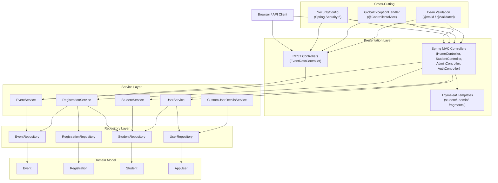
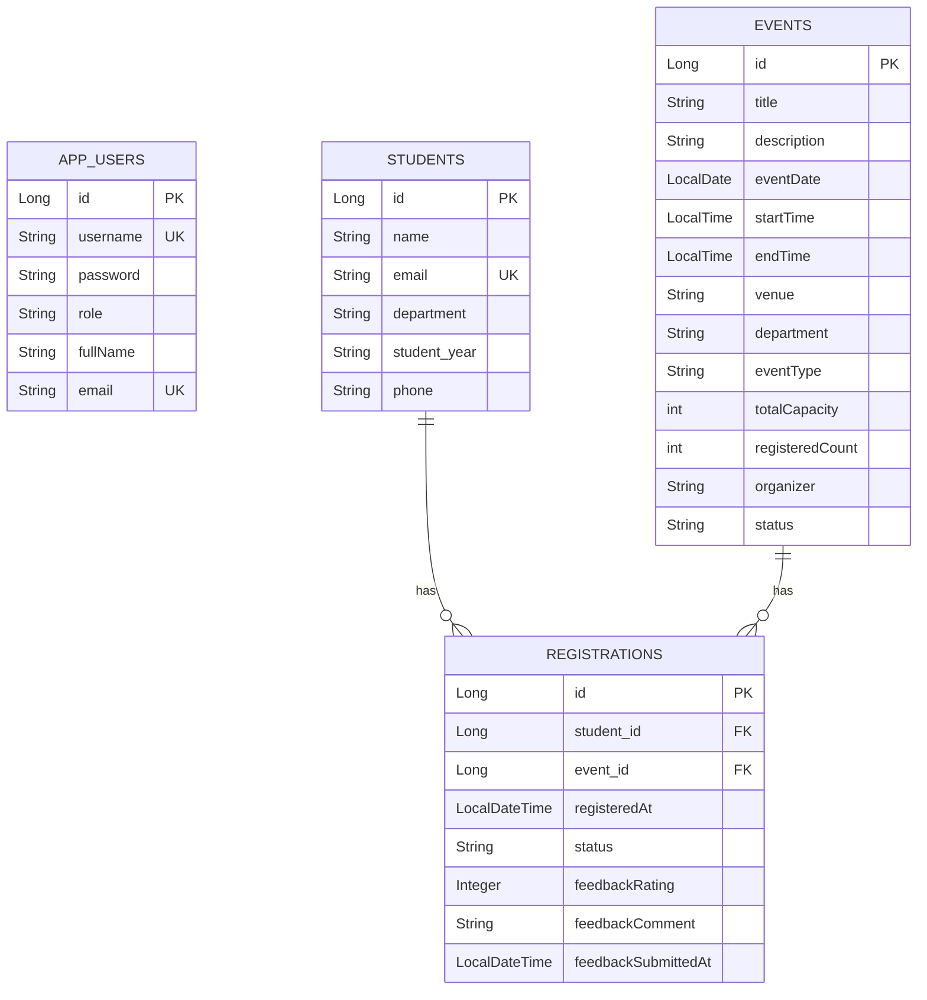
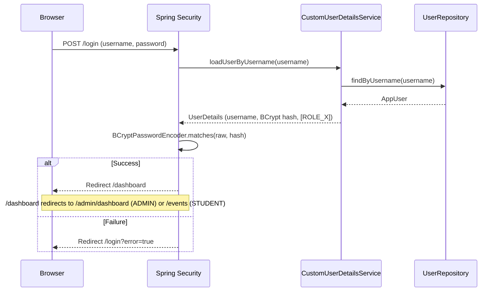

# Design Document: Smart Campus Event Management System

## Overview

The Smart Campus Event Management System (EMS) is a full-stack Spring Boot 3.2 web application that manages campus events, workshops, and seminars for a college or university. It serves two user roles — **Students** (browse, register, cancel, give feedback) and **Admins** (create, edit, delete, search events; manage students; view statistics) — through a server-rendered Thymeleaf UI and a parallel REST API layer.

The system is already substantially implemented. This design document captures the architecture, data model, service contracts, controller/API surface, security rules, and view structure as they exist in the codebase, and formalises the correctness properties that automated tests must verify.

### Technology Stack

| Layer | Technology |
|---|---|
| Language | Java 17 |
| Framework | Spring Boot 3.2 |
| Web / MVC | Spring MVC + Thymeleaf 3 |
| Security | Spring Security 6 (form login, BCrypt) |
| Persistence | Spring Data JPA / Hibernate |
| Database | H2 in-memory (default); MySQL-compatible |
| Validation | Jakarta Bean Validation (Hibernate Validator) |
| Build | Maven |
| Frontend | Vanilla CSS + JS, Chart.js 4 |

---

## Architecture

The application follows a classic layered Spring MVC architecture with a parallel REST API surface.



### Key Architectural Decisions

**Dual-surface design**: Every major data operation is accessible both through Thymeleaf MVC pages (for the browser UI) and through the REST API (for programmatic access). The MVC controllers and REST controllers share the same service layer, ensuring consistent business logic.

**Email as the link between AppUser and Student**: When a user signs up, `UserService.registerNewUser()` creates both an `AppUser` (authentication identity) and a `Student` profile (domain entity), linked by email address. This allows the system to look up a student's profile from the authenticated principal without a foreign-key relationship between the two tables.

**Stateless service layer**: All services are `@Transactional` Spring beans with no instance state. Business rules (capacity checks, duplicate registration checks, status guards) live exclusively in the service layer, not in controllers or repositories.

**H2 in-memory default with MySQL compatibility**: `spring.jpa.hibernate.ddl-auto=create` and H2 dialect auto-detection allow the application to run without any external database. Switching to MySQL requires only changing `application.properties` datasource settings.

---

## Components and Interfaces

### Domain Model



**AppUser** — authentication identity only. Holds username, BCrypt-hashed password, role (`ROLE_ADMIN` or `ROLE_STUDENT`), full name, and email. Not directly linked to `Student` by foreign key; the link is by matching email.

**Student** — campus profile. Holds name, unique email, department, academic year, and optional phone. One student can have many registrations.

**Event** — campus event. Holds all event metadata plus a denormalised `registeredCount` counter that is incremented/decremented atomically by `RegistrationService` to avoid expensive COUNT queries on the hot path.

**Registration** — join entity between Student and Event. Holds registration timestamp, status (`CONFIRMED` / `CANCELLED`), and optional feedback (rating 1–5, comment up to 500 chars, feedback timestamp). The `@PrePersist` hook sets `registeredAt` and defaults `status` to `CONFIRMED`.

### Service Layer Contracts

#### EventService

| Method | Description |
|---|---|
| `getAllEvents()` | Returns all events, no filter |
| `getEventById(id)` | Returns event or throws `ResourceNotFoundException` |
| `saveEvent(event)` | Persists new event; defaults status to `UPCOMING` if blank |
| `updateEvent(id, event)` | Updates all mutable fields on existing event |
| `deleteEvent(id)` | Deletes event or throws `ResourceNotFoundException` |
| `getUpcomingEvents()` | Returns events with status `UPCOMING`, ordered by date ASC |
| `searchEvents(dept, type, status, keyword, dateFrom, dateTo)` | JPQL multi-filter search; null params are ignored |
| `getStatistics()` | Returns map with totalEvents, totalRegistrations, upcomingCount, countByType, countByDepartment, countByStatus, topEvents (top 5 by registeredCount) |

#### RegistrationService

| Method | Description |
|---|---|
| `registerStudentForEvent(studentId, eventId)` | Validates no duplicate, event is UPCOMING, event has capacity; creates CONFIRMED registration; increments `registeredCount` |
| `cancelRegistration(registrationId)` | Sets status to CANCELLED; decrements `registeredCount` (floor 0); throws `BusinessException` if already CANCELLED |
| `submitFeedback(registrationId, rating, comment)` | Sets feedback fields; throws `BusinessException` if feedback already submitted |
| `getRegistrationsByStudent(studentId)` | Returns all registrations with eagerly fetched event data, ordered by `registeredAt` DESC |
| `getRegistrationsByEvent(eventId)` | Returns all registrations for an event |
| `isStudentRegistered(studentId, eventId)` | Boolean check for duplicate registration guard |
| `getRegistrationCountPerStudent()` | Returns `Map<Long, Long>` of studentId → confirmed registration count |

#### StudentService

| Method | Description |
|---|---|
| `registerStudent(student)` | Saves student; throws `BusinessException` on duplicate email |
| `getStudentById(id)` | Returns student or throws `ResourceNotFoundException` |
| `getStudentByEmail(email)` | Returns student or throws `ResourceNotFoundException` |
| `getAllStudents()` | Returns all students |
| `searchStudents(keyword, department, year)` | JPQL search on name/email with optional department and year filters |
| `updateStudent(id, updated)` | Updates name, department, year, phone |
| `deleteStudent(id)` | Deletes student or throws `ResourceNotFoundException` |

#### UserService

| Method | Description |
|---|---|
| `registerNewUser(fullName, username, password, email, department, year, phone)` | Validates unique username and email; creates `AppUser` with `ROLE_STUDENT` and BCrypt-hashed password; creates linked `Student` profile |

#### CustomUserDetailsService

Implements `UserDetailsService`. Loads `AppUser` by username and wraps it in a Spring Security `User` with a single `SimpleGrantedAuthority` matching the stored role string.

### Repository Layer

All repositories extend `JpaRepository<T, Long>` and add custom JPQL queries where needed.

**EventRepository** — key custom queries:
- `findByStatusOrderByEventDateAsc(status)` — upcoming events list
- `searchEvents(dept, type, status, keyword, dateFrom, dateTo)` — multi-filter JPQL with null-safe parameters
- `countByEventType()`, `countByDepartment()`, `countByStatus()` — statistics aggregations
- `totalRegistrations()` — SUM of all `registeredCount`
- `findTopEventsByRegistration()` — ORDER BY `registeredCount` DESC

**RegistrationRepository** — key custom queries:
- `existsByStudentIdAndEventId(studentId, eventId)` — duplicate check
- `findRegistrationsWithEventsByStudentId(studentId)` — JOIN FETCH for my-events page
- `countRegistrationsPerStudent()` — GROUP BY for admin students page
- `avgRatingByEventId(eventId)` — average feedback rating

**StudentRepository** — key custom queries:
- `existsByEmail(email)` — duplicate email check
- `searchStudents(keyword, department, year)` — multi-filter JPQL

### Controller / URL Mapping

#### MVC Controllers

| Controller | Base Path | Key Routes |
|---|---|---|
| `HomeController` | `/` | `GET /` (home), `GET /events` (public browse), `GET /events/{id}` (detail), `GET /login`, `GET /dashboard` (role redirect) |
| `AuthController` | `/` | `GET /signup`, `POST /signup` |
| `StudentController` | `/student` | `GET/POST /student/register`, `GET /student/my-events`, `POST /student/events/{id}/register`, `POST /student/feedback/{regId}`, `POST /student/cancel/{regId}` |
| `AdminController` | `/admin` | `GET /admin/dashboard`, `GET/POST /admin/events`, `GET/POST /admin/events/new`, `GET/POST /admin/events/{id}/edit`, `POST /admin/events/{id}/delete`, `GET /admin/events/{id}/registrations`, `POST /admin/registrations/{regId}/cancel`, `GET /admin/statistics`, `GET /admin/students`, `GET /admin/students/{id}`, `POST /admin/students/{id}/delete` |

#### REST Controller

| Method | Path | Description |
|---|---|---|
| `GET` | `/api/events` | All events |
| `GET` | `/api/events/upcoming` | UPCOMING events |
| `GET` | `/api/events/{id}` | Single event |
| `GET` | `/api/events/search` | Multi-filter search (query params: department, eventType, status, keyword) |
| `POST` | `/api/events` | Create event (Admin) |
| `PUT` | `/api/events/{id}` | Update event (Admin) |
| `DELETE` | `/api/events/{id}` | Delete event (Admin) |
| `GET` | `/api/events/statistics` | Statistics map |

---

## Data Models

### Validation Constraints Summary

| Entity | Field | Constraints |
|---|---|---|
| `Event` | title | `@NotBlank`, `@Size(min=3, max=150)` |
| `Event` | description | `@NotBlank`, `@Size(min=10, max=1000)` |
| `Event` | eventDate | `@NotNull` |
| `Event` | venue | `@NotBlank` |
| `Event` | department | `@NotBlank` |
| `Event` | eventType | `@NotBlank` |
| `Event` | totalCapacity | `@Min(1)`, `@Max(1000)` |
| `Event` | organizer | `@NotBlank` |
| `Student` | name | `@NotBlank`, `@Size(min=2, max=100)` |
| `Student` | email | `@NotBlank`, `@Email`, `@Column(unique=true)` |
| `Student` | department | `@NotBlank` |
| `Student` | phone | `@Pattern(regexp="^[0-9]{10}$")` (optional) |
| `Registration` | feedbackRating | `@Min(1)`, `@Max(5)` |
| `Registration` | feedbackComment | `@Size(max=500)` |
| `AppUser` | username | `@Column(unique=true, nullable=false)` |
| `AppUser` | password | min 6 chars enforced in `UserService` |

### Status Enumerations (stored as String)

**Event.status**: `UPCOMING` | `ONGOING` | `COMPLETED` | `CANCELLED`

**Registration.status**: `CONFIRMED` | `CANCELLED`

### Seed Data

Loaded by `CommandLineRunner` in `SmartCampusEmsApplication` on first startup (guarded by existence checks):

- `AppUser`: admin/admin123 (ROLE_ADMIN), student/student123 (ROLE_STUDENT)
- `Student`: 3 sample students (Varun Kumar/CSE, Priya Sharma/ECE, Arjun Mehta/MECH)
- `Event`: 5 UPCOMING events (AI Workshop, Hackathon, Career Seminar, Cloud Bootcamp, Cultural Fest)

---

## Security Design

Spring Security 6 is configured in `SecurityConfig` with `@EnableWebSecurity` and `@EnableMethodSecurity`.

### URL Authorization Matrix

| URL Pattern | Access |
|---|---|
| `/`, `/events`, `/events/**` | Public (permitAll) |
| `/student/register`, `/signup`, `/login` | Public (permitAll) |
| `/api/events`, `/api/events/**` | Public (permitAll) |
| `/css/**`, `/js/**`, `/h2-console/**` | Public (permitAll) |
| `/student/events/**` | Public (permitAll) |
| `/student/my-events`, `/student/feedback/**`, `/student/cancel/**` | `ROLE_STUDENT` or `ROLE_ADMIN` |
| `/admin/**` | `ROLE_ADMIN` only |
| All other URLs | Authenticated |

### Authentication Flow



### CSRF Policy

CSRF protection is enabled for all MVC form submissions. It is disabled for `/h2-console/**` and `/api/**` to support the H2 console and REST API clients. All Thymeleaf forms automatically include the CSRF token via Spring Security's Thymeleaf integration.

### Password Encoding

`BCryptPasswordEncoder` is the sole `PasswordEncoder` bean. All passwords are encoded before persistence. The H2 console and demo credentials (`admin123`, `student123`) are encoded at seed time.

---

## Thymeleaf View Structure

```
templates/
├── fragments/
│   └── layout.html          # navbar, flash-messages, footer fragments
├── index.html               # Public home page with hero, stats, upcoming events preview
├── login.html               # Standalone login page (no navbar layout)
├── signup.html              # Account creation form
├── error.html               # Unified error page (errorCode, errorTitle, errorMessage)
├── student/
│   ├── events.html          # Public event browse with filter bar and card grid
│   ├── event-detail.html    # Event detail with registration form
│   ├── my-events.html       # Authenticated student's registrations with feedback/cancel
│   └── register.html        # Student profile creation form
└── admin/
    ├── dashboard.html       # Stats grid, guide box, quick nav, upcoming events table
    ├── events.html          # Full event table with multi-filter bar
    ├── event-form.html      # Create/edit event form (isEdit flag)
    ├── registrations.html   # Per-event registration table with cancel action
    ├── statistics.html      # Chart.js charts + top events table
    ├── students.html        # Student list with search/filter
    └── student-detail.html  # Student profile + registration history
```

### Fragment System

`fragments/layout.html` provides three reusable fragments:

- **`navbar`** — sticky top navigation bar with role-conditional links (`sec:authorize`)
- **`flash-messages`** — renders `successMessage` and `errorMessage` flash attributes as dismissible alerts
- **`footer`** — simple footer with branding

All pages (except `login.html`) include the navbar and footer via `th:replace`.

### Flash Message Pattern

Controllers use `RedirectAttributes.addFlashAttribute("successMessage", ...)` or `"errorMessage"` to pass one-time messages across redirects. The `flash-messages` fragment renders them and `app.js` auto-dismisses them after 5 seconds.

---

## Error Handling

`GlobalExceptionHandler` (`@ControllerAdvice`) handles all exceptions:

| Exception | MVC Response | REST Response |
|---|---|---|
| `ResourceNotFoundException` | Renders `error.html` with errorCode=404 | (falls through to MVC handler — REST callers should handle 404 from `@ResponseStatus`) |
| `BusinessException` | Renders `error.html` with errorCode=400 | (falls through to MVC handler) |
| `MethodArgumentNotValidException` | `@ResponseBody` 400 JSON with field errors map | 400 JSON `{status, timestamp, message, errors}` |
| `Exception` (catch-all) | Renders `error.html` with errorCode=500 | Renders `error.html` with errorCode=500 |

For MVC form submissions, validation errors are handled inline: controllers check `BindingResult.hasErrors()` and re-render the form template with `th:errors` field-level messages rather than redirecting to the error page.

---

## Correctness Properties

*A property is a characteristic or behavior that should hold true across all valid executions of a system — essentially, a formal statement about what the system should do. Properties serve as the bridge between human-readable specifications and machine-verifiable correctness guarantees.*

### Property 1: User registration rejects invalid credentials

*For any* signup attempt where the password is shorter than 6 characters, the passwords do not match, or the username already exists in the system, the registration SHALL be rejected and no new `AppUser` or `Student` record SHALL be created.

**Validates: Requirements 1.1, 1.3**

---

### Property 2: Registered users have correct role and hashed password

*For any* successful user registration with valid inputs, the created `AppUser` SHALL have `role == "ROLE_STUDENT"` and the stored password SHALL satisfy `BCryptPasswordEncoder.matches(rawPassword, storedPassword) == true`.

**Validates: Requirements 1.2**

---

### Property 3: Admin URLs are inaccessible to students

*For any* request to a URL matching `/admin/**` made by a principal with `ROLE_STUDENT`, the system SHALL deny access (HTTP 403 or redirect to login), and the admin resource SHALL NOT be returned.

**Validates: Requirements 2.2**

---

### Property 4: Student validation constraints are universally enforced

*For any* `Student` object where at least one field violates its declared constraint (name outside 2–100 chars, invalid email format, phone not matching 10 digits), the system SHALL reject the object and no record SHALL be persisted.

**Validates: Requirements 3.1, 3.3, 14.1**

---

### Property 5: Duplicate student email is always rejected

*For any* email address that is already associated with an existing `Student` record, attempting to register a new student with that same email SHALL throw a `BusinessException` and leave the existing record unchanged.

**Validates: Requirements 3.2**

---

### Property 6: Public event listing contains only UPCOMING events in date order

*For any* set of events with mixed statuses and dates stored in the system, the result of `getUpcomingEvents()` SHALL contain only events with `status == "UPCOMING"` and SHALL be ordered by `eventDate` ascending.

**Validates: Requirements 4.1**

---

### Property 7: Event search filters are conjunctively applied

*For any* combination of non-null filter parameters (department, eventType, status, keyword, dateFrom, dateTo), every event returned by `searchEvents()` SHALL satisfy all active filter conditions simultaneously. Keyword matching SHALL be case-insensitive against both `title` and `description`.

**Validates: Requirements 4.2, 10.1, 10.2**

---

### Property 8: Successful registration increments count and sets timestamp

*For any* UPCOMING event with available capacity and a student not already registered, calling `registerStudentForEvent()` SHALL create a `Registration` with `status == "CONFIRMED"`, a non-null `registeredAt` timestamp, and SHALL increment the event's `registeredCount` by exactly 1.

**Validates: Requirements 5.1, 5.3**

---

### Property 9: Registration business rules are universally enforced

*For any* registration attempt that violates a business rule — student already registered for the event, event is at full capacity, or event status is not `UPCOMING` — the system SHALL throw a `BusinessException` and leave `registeredCount` unchanged.

**Validates: Requirements 5.2**

---

### Property 10: Cancellation decrements count and never goes below zero

*For any* `CONFIRMED` registration, calling `cancelRegistration()` SHALL set `status` to `CANCELLED` and SHALL decrement the associated event's `registeredCount` by 1, with the invariant that `registeredCount` SHALL never be decremented below 0.

**Validates: Requirements 7.1, 7.3**

---

### Property 11: Double cancellation is always rejected

*For any* registration that already has `status == "CANCELLED"`, calling `cancelRegistration()` again SHALL throw a `BusinessException` and leave the registration and event state unchanged.

**Validates: Requirements 7.2**

---

### Property 12: Feedback validation and idempotence

*For any* feedback submission, a rating outside the range [1, 5] or a comment exceeding 500 characters SHALL be rejected by Bean Validation. For any registration that already has a non-null `feedbackRating`, a second call to `submitFeedback()` SHALL throw a `BusinessException`.

**Validates: Requirements 8.1, 8.2**

---

### Property 13: Event validation constraints are universally enforced

*For any* `Event` object where at least one field violates its declared constraint (title outside 3–150 chars, description outside 10–1000 chars, capacity outside 1–1000, blank required fields), the system SHALL reject the object and no record SHALL be persisted or updated.

**Validates: Requirements 9.1, 14.1**

---

### Property 14: New events default to UPCOMING status

*For any* event saved via `EventService.saveEvent()` without an explicit status value, the persisted event SHALL have `status == "UPCOMING"`.

**Validates: Requirements 9.2**

---

### Property 15: Statistics accurately reflect stored data

*For any* state of the events and registrations tables, the map returned by `getStatistics()` SHALL satisfy: `totalEvents == eventRepository.count()`, `totalRegistrations == SUM(event.registeredCount)`, and `upcomingCount == count of events with status UPCOMING`.

**Validates: Requirements 12.1**

---

### Property 16: Student search filters are conjunctively applied

*For any* combination of non-null search parameters (keyword, department, year), every student returned by `searchStudents()` SHALL satisfy all active filter conditions simultaneously. Keyword matching SHALL be case-insensitive against both `name` and `email`.

**Validates: Requirements 13.1, 13.2**

---

### Property 17: REST API returns HTTP 400 for invalid payloads

*For any* POST or PUT request to a REST endpoint with a request body that fails Bean Validation, the system SHALL return HTTP 400 with a JSON body containing a field-level errors map.

**Validates: Requirements 14.3**

---

### Property 18: Exception handler maps exception types to correct error codes

*For any* `ResourceNotFoundException` thrown during request processing, the error page SHALL be rendered with `errorCode == "404"`. For any `BusinessException`, the error page SHALL be rendered with `errorCode == "400"`.

**Validates: Requirements 15.1**

---

## Testing Strategy

### Dual Testing Approach

The project uses **JUnit 5** and **Spring Boot Test** (already on the classpath via `spring-boot-starter-test`). The testing strategy combines:

- **Unit tests** — test service and validation logic in isolation with mocked repositories
- **Property-based tests** — verify universal properties across many generated inputs
- **Integration tests** — verify MVC controller behaviour, security rules, and REST API responses using `@SpringBootTest` + `MockMvc`
- **Smoke tests** — verify seed data and one-time configuration

### Property-Based Testing Library

Use **[jqwik](https://jqwik.net/)** (Java property-based testing library, JUnit 5 compatible). Add to `pom.xml`:

```xml
<dependency>
    <groupId>net.jqwik</groupId>
    <artifactId>jqwik</artifactId>
    <version>1.8.2</version>
    <scope>test</scope>
</dependency>
```

Each property test runs a minimum of **100 iterations** by default in jqwik (`@Property(tries = 100)`).

### Test Organisation

```
src/test/java/com/campus/ems/
├── service/
│   ├── UserServiceTest.java          # Properties 1, 2
│   ├── RegistrationServiceTest.java  # Properties 8, 9, 10, 11, 12
│   ├── EventServiceTest.java         # Properties 6, 7, 13, 14, 15
│   └── StudentServiceTest.java       # Properties 4, 5, 16
├── controller/
│   ├── SecurityAccessTest.java       # Property 3 (MockMvc + Spring Security)
│   ├── EventRestControllerTest.java  # Property 17 (MockMvc REST)
│   └── GlobalExceptionHandlerTest.java # Property 18
└── smoke/
    └── SeedDataTest.java             # Seed data smoke tests (Req 16)
```

### Property Test Tag Format

Each property-based test method is annotated with a comment referencing the design property:

```java
// Feature: smart-campus-ems, Property 6: Public event listing contains only UPCOMING events in date order
@Property(tries = 200)
void upcomingEventsAreOnlyUpcomingAndSortedByDate(...) { ... }
```

### Unit Test Focus Areas

Unit tests (example-based) cover:
- Specific redirect behaviour after login/logout (Req 2.1, 2.3)
- Form re-render with field errors on invalid submission (Req 14.2)
- Error page rendering for 404 and 500 scenarios (Req 15.2)
- Admin dashboard model attributes (Req 12.2 — Chart.js data present)

### Integration Test Focus Areas

Integration tests cover:
- Full MVC request/response cycle for key student and admin flows
- REST API endpoint responses (status codes, JSON structure)
- Spring Security filter chain behaviour (public vs. protected URLs)

### Smoke Tests

Smoke tests (single execution, `@SpringBootTest`) verify:
- Admin user `admin` exists with `ROLE_ADMIN` after startup (Req 16.1)
- Student user `student` exists with `ROLE_STUDENT` after startup (Req 16.1)
- At least 3 `Student` records exist after startup (Req 16.2)
- At least 5 `UPCOMING` events exist after startup (Req 16.2)
